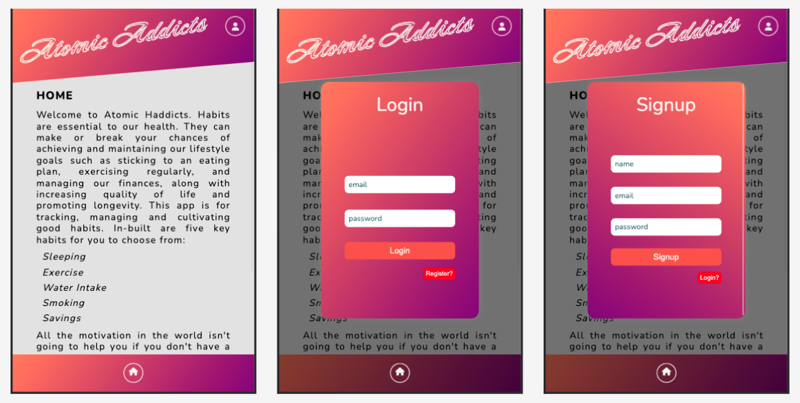
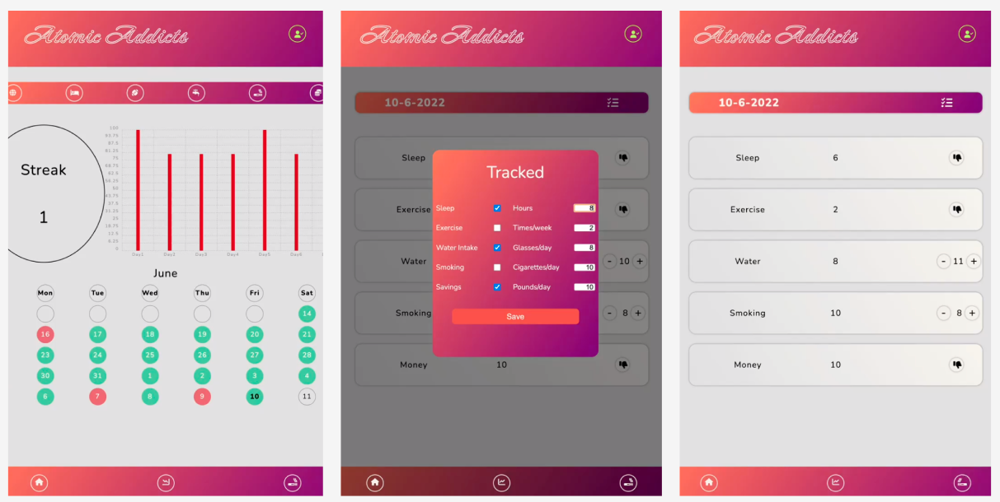
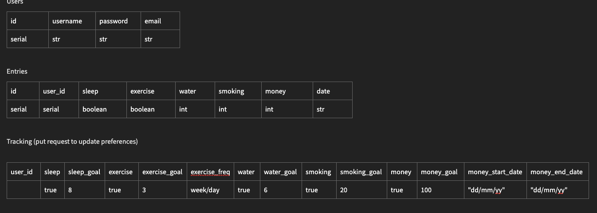
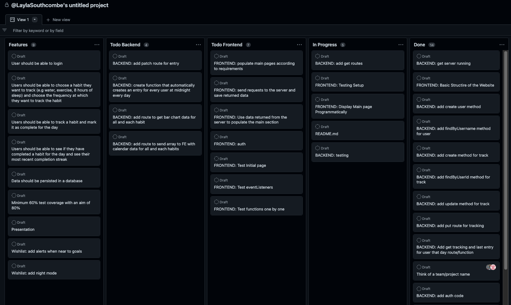
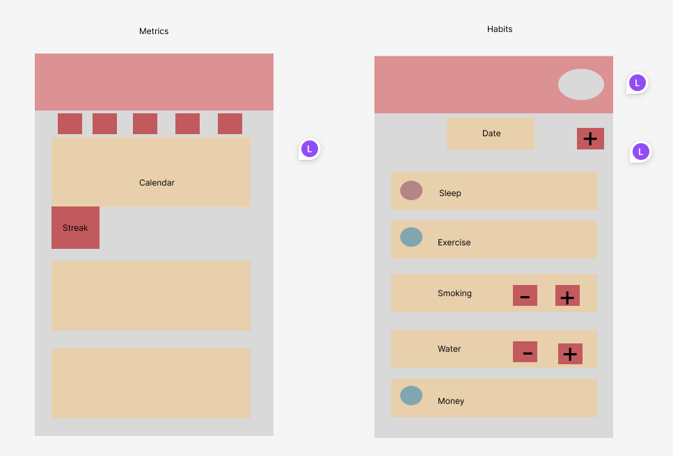
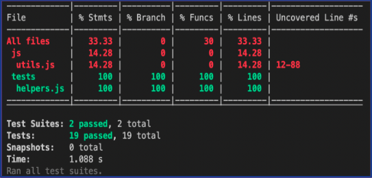
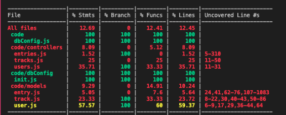

# LAP 2 Project - Atomic Addicts - Habit Tracker

## Design

## Account login page

<!-- ABOUT THE PROJECT -->

# Purpose of the App

Atomic Addicts is our LAP 2 Project. This app is for tracking, managing and cultivating habits. In-built are five key habits for you to choose from: `Sleeping, Exercise, Water Intake, Smoking, Savings`

It has the following functionality for users:

- Users should be able to login
- Users should be able to logout
- Users should be able to choose a habit they want to track (e.g water, exercise, 8 hours of sleep) and choose the frequency at which they want to track the habit
- Users should be able to track a habit and mark it as complete for the day
- Users should be able to see if they have completed a habit for the day and see their most recent completion streak

### Remote Hosting

The site is hosted [here](https://atomic-addicts.netlify.app/) on Netlify
and our API is hosted [here]() on Heroku.

# Installation and Usage

## Prerequisites

- Docker

## Installation

- Fork and clone this repo

## Usage

- Navigate to the project folder
- Run: `bash _scripts/startDev.sh`

  - Server in localhost:3000
  - Client in localhost:8080

- To rexecute the tests:

  - Run: `bash _scripts/startTest.sh`

- To perfom a complete teardown of the app:
  - Run: `bash _scripts/teardown.sh`

Do not run startDev and startTest simulanteously.

## Technologies

- HTML/CSS
- JavaScript
  - Node.js
  - Express
  - Cors
  - Jest
  - Supertest
  - Nodemon
- Docker
- PostgreSQL
- Bcrypt
- JSON Web Token
- Chartist ( a Chart generator)

## Process

### Database planning

### GitHub project planning

### Figma design

### Inspiration apps

- [Snap Habit](https://snaphabit.app/)
- [Strides](https://www.stridesapp.com/)
- [MyFintessPal](https://www.myfitnesspal.com/)

### Test Coverage

- Client side: 33%

- Server side: 12%

### Wins

### Challenges

- Creating most of the UI dynamically
- Implementing Authorization
- Testing

### Code snippets

### Contributors

- <a href="https://github.com/LaylaSouthcombe">Layla Southcombe</a>
- <a href="https://github.com/aha000111">Amir Ali</a>
- <a href="https://github.com/buscaroli">Matteo Buscaroli</a>
- <a href="https://github.com/Igormirowski">Igor Mirowski</a>

Project Link: [Project](https://github.com/LaylaSouthcombe/lap2project)

### Future features

- Social media integration e.g. Tweet your habits, Instagram and Facbook intergration

- Display weather based on location

- Customisation i.e. creating your own habits

- Night more
